## Lab 1

Manually create and integrate API gateway endpoint and Lambda

---

### Open Lambda service:

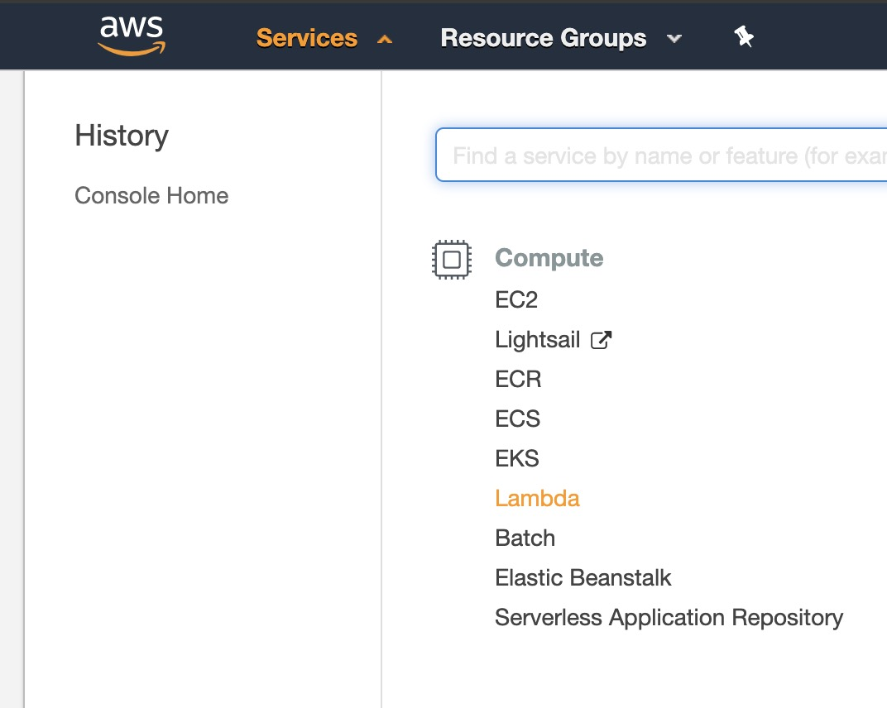
&nbsp;

### Create new function:

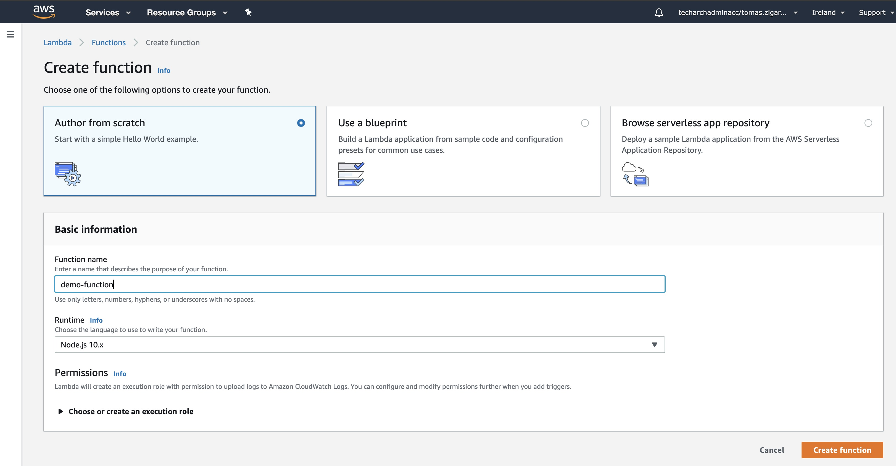
&nbsp;

### Save function:

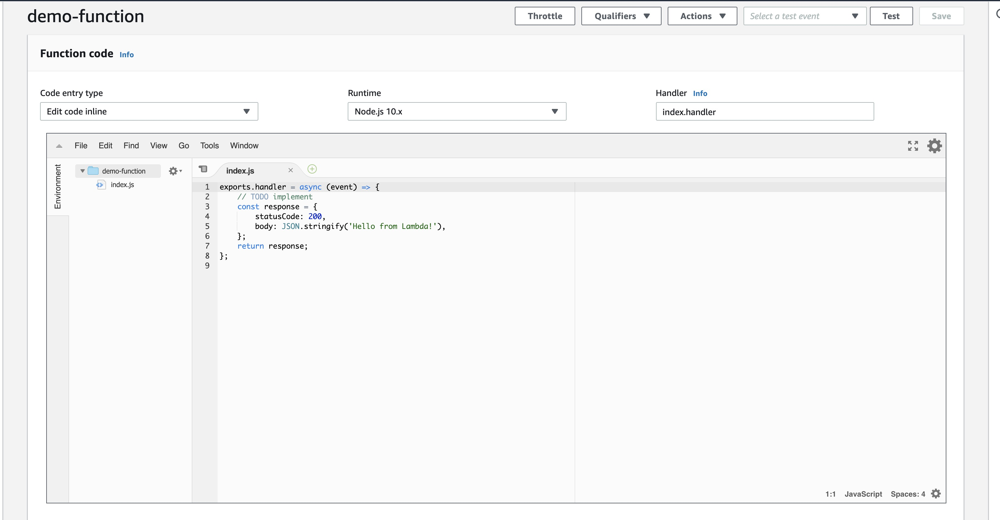
&nbsp;

### Open API Gateway service:

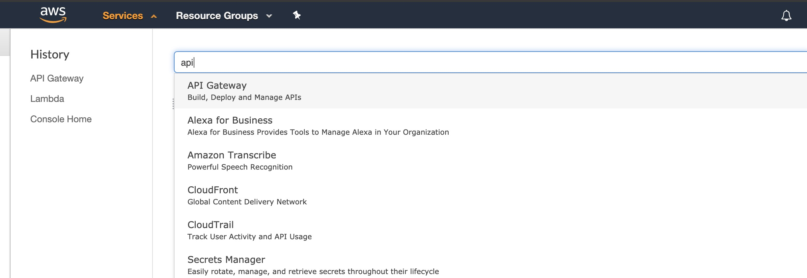
&nbsp;

### Create new API:

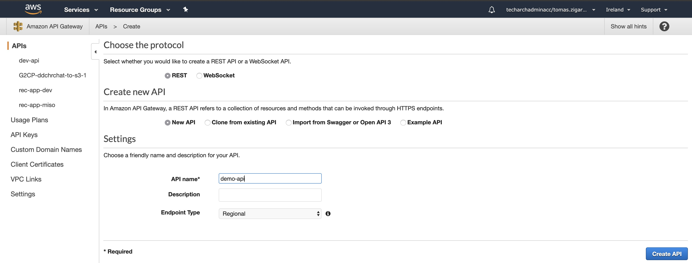
&nbsp;

### Actions -> Create Method -> GET:

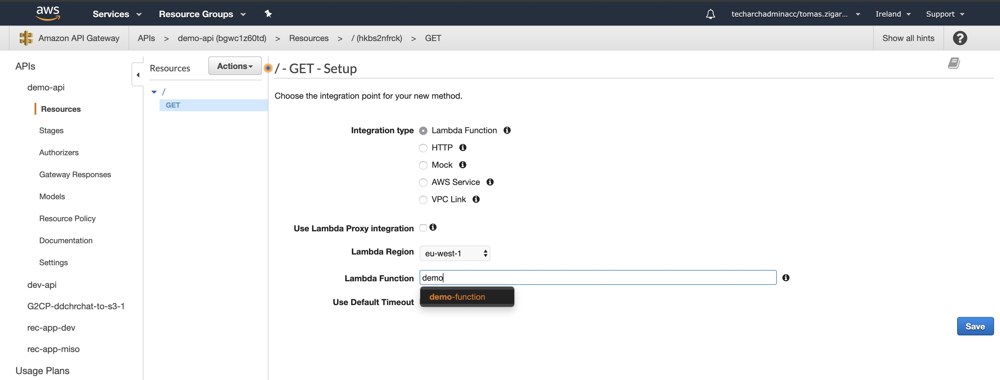
&nbsp;

### Run test:

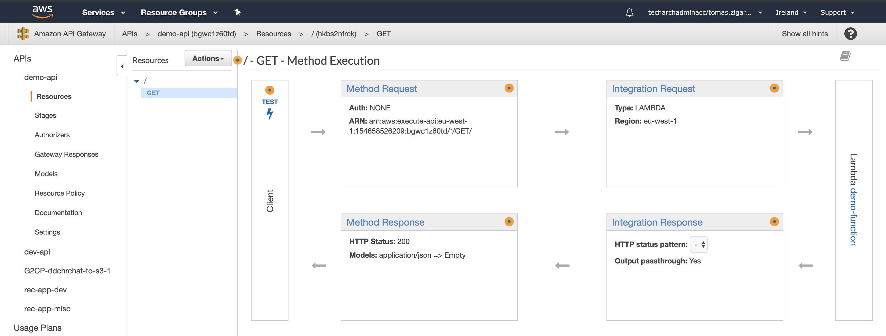
&nbsp;

### Test results:

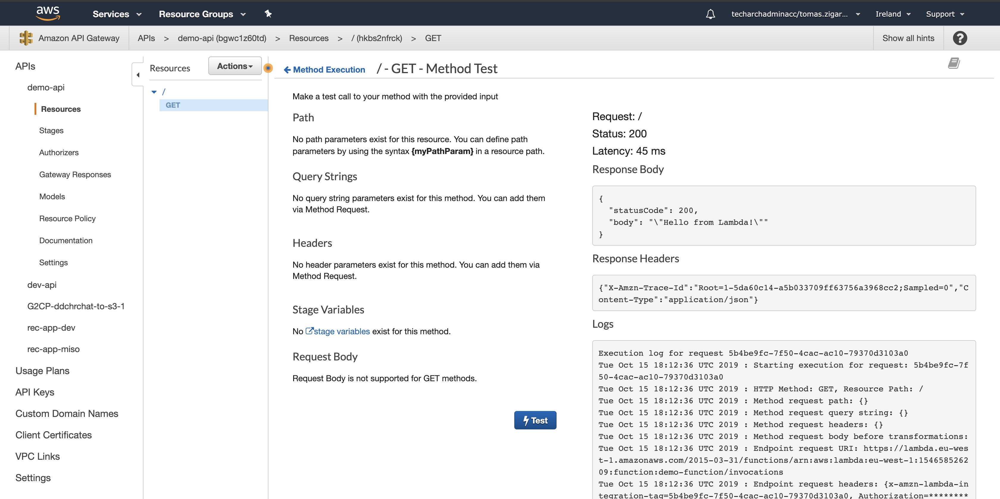
&nbsp;

### Deploy API:

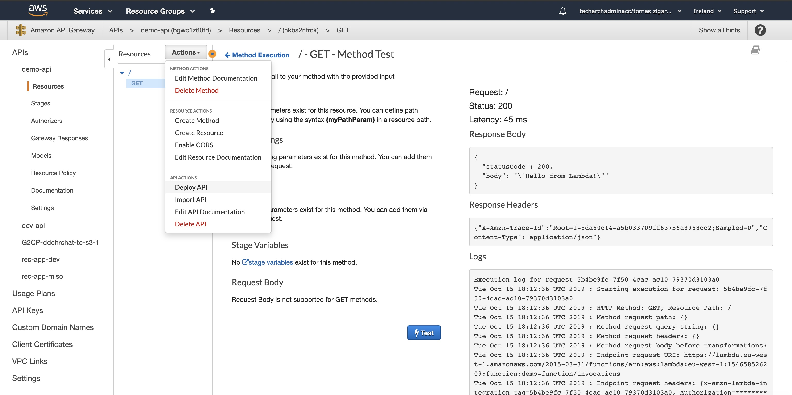
&nbsp;

### Deploy API:

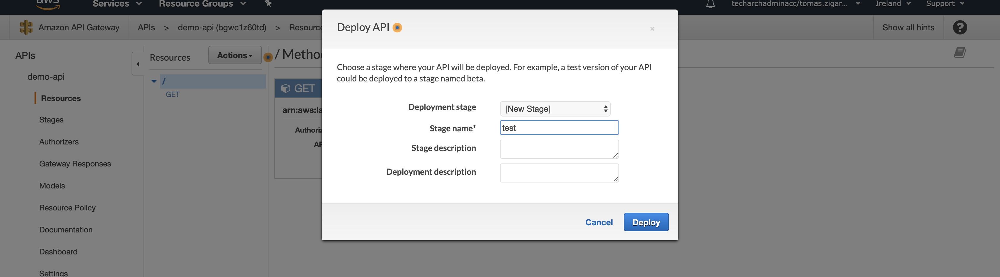
&nbsp;

### Copy URL:

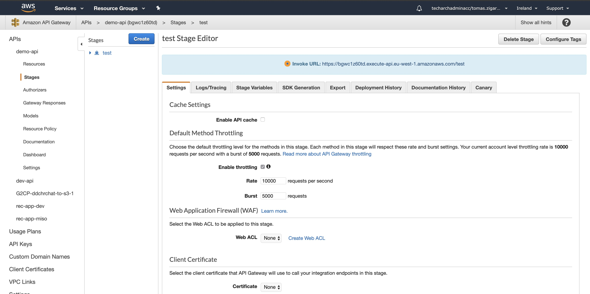
&nbsp;

### Open in browser:

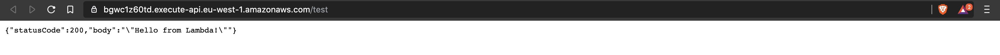