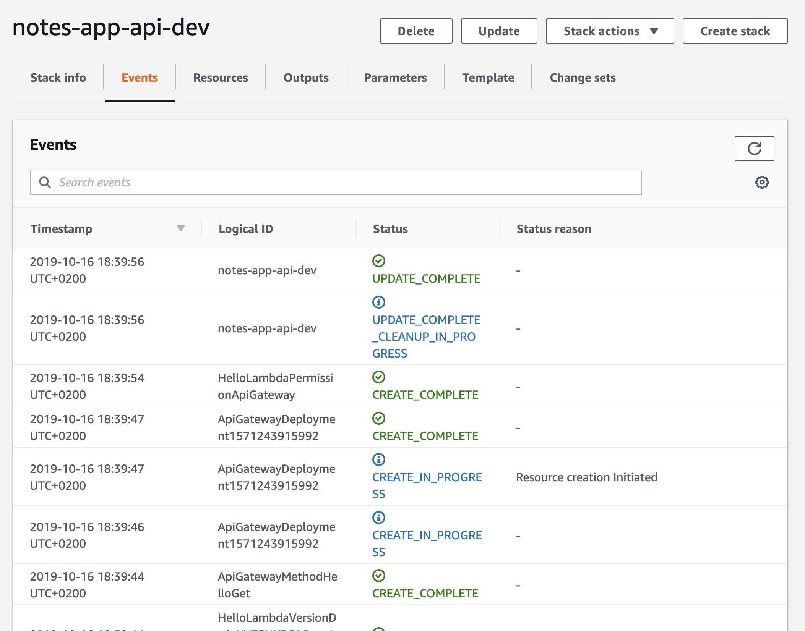

## Lab 2

Create Lambda and API using serverless

---

### Prerequisities

0. execute `aws configure` and enter credentials to AWS (or use [AWS profiles](https://docs.aws.amazon.com/cli/latest/userguide/cli-configure-profiles.html))
1. clone repository: `git clone https://github.com/pavestru/serverless-workshop-api`
1. open folder: `cd serverless-workshop-api`
1. get to branch 00-hello: `git checkout 00-hello`
1. run: `npm install`

### Set the STAGE

1. Create `.env` file with this content: `STAGE=your_unique_name` (change your_unique_name to something else)
1. Open `serverless.yml` and change `stage: dev` to `stage: ${env:STAGE}`

### Deploy and test

1. `serverless deploy` or `sls deploy`
1. Open URL from terminal output after "endpoints:" in your browser.
1. In AWS console, check newly created Lambda and API.
1. In AWS console, check service "CloudFormation" and newly created stack notes-app-api-your_unique_name

### Cloudformation:

&nbsp;

## Clean-up

To remove the deployed resources, use `serverless remove`
