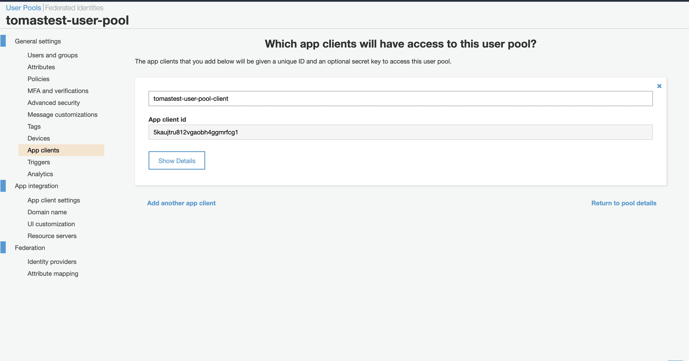
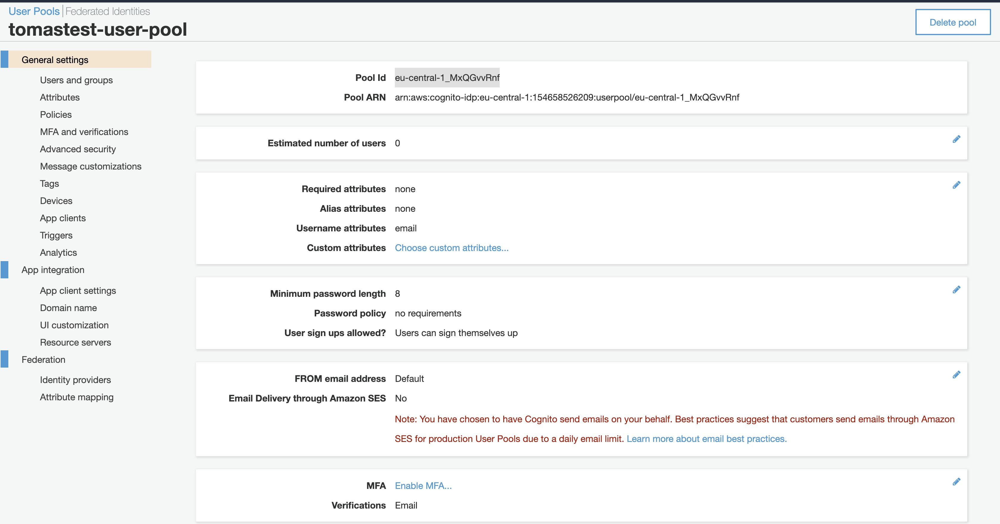
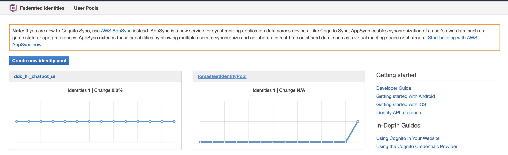
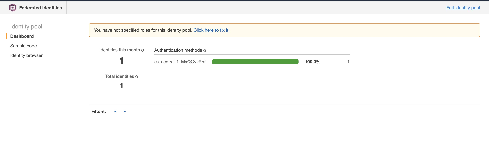
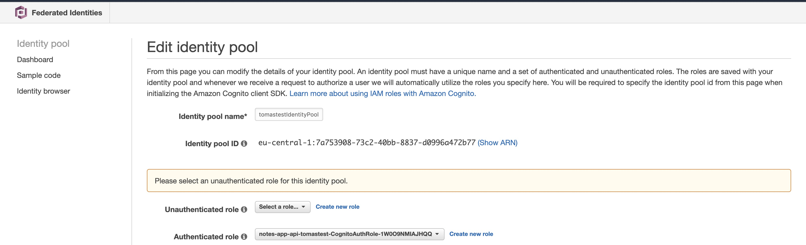
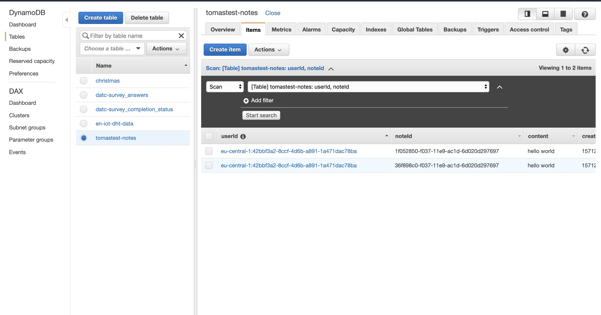
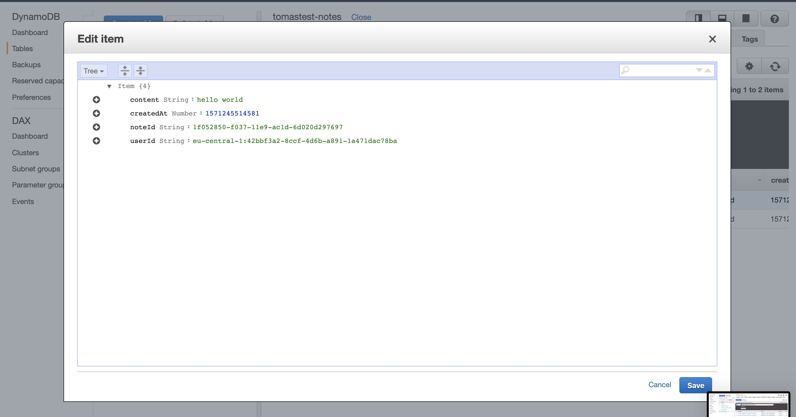

## Lab 3

Implement CRUD methods "create" and "delete" for Notes App API (get, update and list are already done).

### Prerequisities

1. clone repository (or use the one from Lab 2) `git clone https://github.com/pavestru/serverless-workshop-api`
2. open folder: `cd serverless-workshop-api`
3. get to branch 01-api: `git checkout 01-api`
4. run: `npm install`
5. Create `.env` file with this content (if not done before): `STAGE=your_unique_name`

### Tasks

1. Create files "create.js" and "delete.js" with "create" function and "delete" function
1. These lambda functions create/delete items in DynamoDb
1. Update serverless.yml: add there POST API endpoint for "create" and DELETE API endpoint for "delete".

### Hints

- [DynamoDB CRUD Guide](https://docs.aws.amazon.com/amazondynamodb/latest/developerguide/GettingStarted.NodeJs.03.html)
- You can get the inspiration from "get.js", "list.js" and "update.js" and serverless.yml
- You can find the solution in branch master of the same repository

### Deploy solution

1. `serverless deploy`
1. In AWS console, check newly created Lambda and API.
1. In AWS console, check service "CloudFormation" and newly created stack notes-app-api-your_unique_name

### Test solution

Use these scripts to test the API. Update them with your values:

- aws-user-signup.sh (creates a new user)
- aws-user-confirm.sh (confirms the new user)
- api-test.sh (authenticates user and runs HTTP request)

aws-user-signup.sh example:

```
aws cognito-idp sign-up \
  --region eu-central-1 \
  --client-id 5kaujtru812vgaobh4ggmrfcg1 \
  --username admin@example.com \
  --password Passw0rd!
```

aws-user-confirm.sh example:

```
aws cognito-idp admin-confirm-sign-up \
  --region eu-central-1 \
  --user-pool-id eu-central-1_MxQGvvRnf \
  --username admin@example.com
```

api-test.sh example:

```
npx aws-api-gateway-cli-test \
--username='admin@example.com' \
--password='Passw0rd!' \
--user-pool-id='eu-central-1_MxQGvvRnf' \
--app-client-id='5kaujtru812vgaobh4ggmrfcg1' \
--cognito-region='eu-central-1' \
--identity-pool-id='eu-central-1:7a753908-73c2-40bb-8837-d0996a472b77' \
--invoke-url='https://oq5ikypdaf.execute-api.eu-central-1.amazonaws.com/tomastest' \
--api-gateway-region='eu-central-1' \
--path-template='/notes' \
--method='POST' \
--body='{"content":"hello world"}'
```

run scripts:

- `./aws-user-signup.sh`
- `./aws-user-confirm.sh`
- `./api-test.sh`

### Find app client id:


&nbsp;

### Find user pool id:


&nbsp;

### Find identity id:


&nbsp;

### Find identity id:


&nbsp;

### Find identity id:


&nbsp;

### Results in DynamoDb:


&nbsp;

### Results in DynamoDb:


